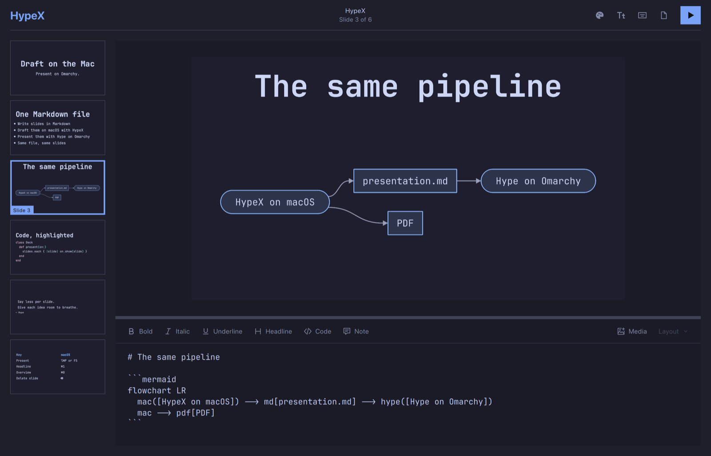
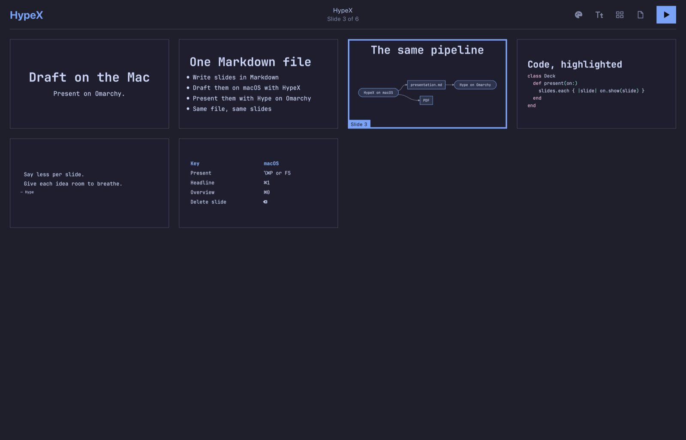
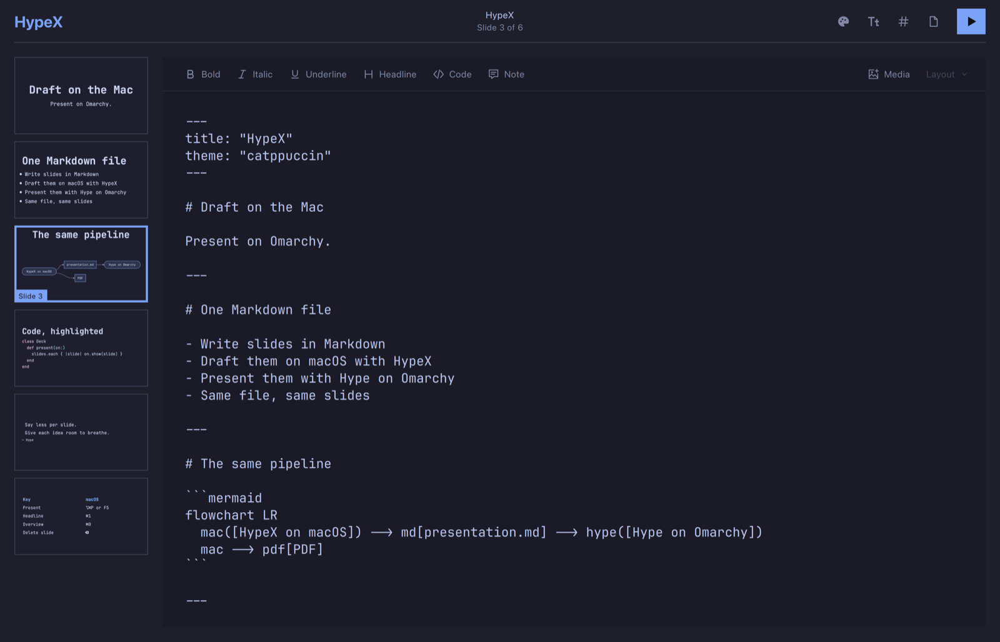
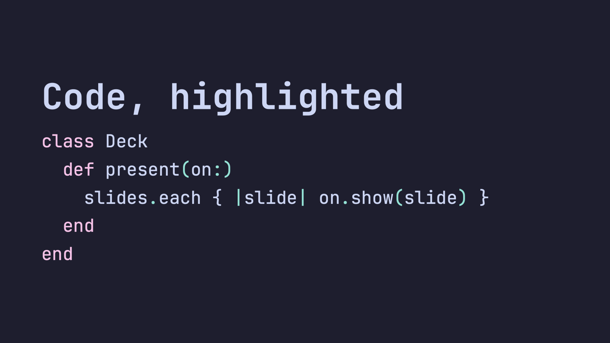
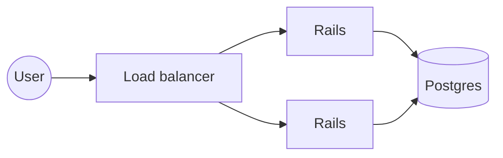

# HypeX

**HypeX is a port of [Hype](https://github.com/omacom/hype) to macOS.** Hype is the Markdown presentation app for [Omarchy](https://omarchy.org); HypeX brings the same editor to the Mac so you can draft your slides there, then present them with Hype on Omarchy.

The presentation is the same Markdown file on both. HypeX is Hype's own code (parser, renderer, editor) built for macOS, not a reimplementation, so a deck drafted on the Mac is the deck Hype reads on Omarchy. A round-trip test holds it to that: opening, editing and saving a deck in HypeX leaves the file byte-identical.



## What's different from Hype

- **Built for macOS.** A native `HypeX.app` with macOS file dialogs, Finder **Open With**, and ⌘ shortcuts.
- **Export to PDF and PowerPoint.** The same exporters as Hype on Omarchy, with presenter notes carried into PowerPoint.
- **Omarchy's themes built in.** The 22 stock Omarchy themes ship inside the app, so a deck previews in the theme it will be presented with.
- **Font check.** `hype check` warns when a deck uses a font that Omarchy doesn't install by default, because text is sized to fit and another font changes the layout.
- **Two features ahead of Hype.** HypeX includes presenter view ([omacom/hype#6](https://github.com/omacom/hype/pull/6)) and Mermaid flowcharts ([omacom/hype#9](https://github.com/omacom/hype/pull/9)), both still open upstream. Until #9 is merged, a deck with a `mermaid` block needs a Hype build with that change to show the diagram on Omarchy; stock Hype shows it as a code block.

## Install

HypeX builds on an Apple silicon Mac with [Homebrew](https://brew.sh), against the libraries Homebrew installs for your version of macOS. The [Brewfile](Brewfile) lists everything it needs: Qt, source-highlight, ffmpeg, webp, dylibbundler, and the JetBrains Mono fonts Omarchy uses.

```sh
git clone https://github.com/gscalzo/HypeX.git
cd HypeX
brew bundle
bin/install-macos
```

`bin/install-macos` builds `HypeX.app`, copies it to `/Applications`, and installs the `hype` command in Homebrew's `bin`. Open **HypeX** from Spotlight or Launchpad, choose **Open With → HypeX** on a Markdown file in Finder, drop a file on the Dock icon, or run `hype open` in a terminal.

The app bundles Qt, source-highlight and the themes, and uses Homebrew's ffmpeg for video frames. It is ad-hoc signed for your own Mac, not notarized. `bin/build-macos` builds `build-macos/HypeX.app` without installing it.

## Make a presentation

HypeX reopens your last presentation; use **⌘N** to start a new one, or **⌘O** to choose a Markdown file.

In **Visual** mode, select a slide in the sidebar and write its Markdown below the preview. Changes appear as you type. Drag the divider to give the preview or editor more room. The mode button steps through **Overview**, **Visual**, and **Markdown**; **⌘0** flips the overview on and off, and **⌘.** flips the Markdown source.

**Overview** fills the window with every slide. Select, rearrange, duplicate, and delete slides there as you would in the sidebar. Double-click a slide or press **Return** to open it.



**Markdown** mode edits the whole presentation at once, with the same formatting bar on top.



The buttons above the editor apply bold, italic, underline, headlines, code blocks, and hidden notes to your selection. `*asterisks*` are italic and `_underscores_` are underline. **Media** adds an image or video; **Layout** opens its layout and background options.

Use **⌘Return** or right-click a slide to add one after the selection. Drag slides to rearrange them, or select several with **⇧-click** or **⇧-arrows** to move, duplicate, or delete them together.

HypeX saves automatically after a one-second pause, or every five seconds while you keep typing. **⌘S** saves immediately or names a new presentation. Every saved version stays in `.hype-backups/` beside your presentation, and **Version history** in the file menu restores earlier snapshots, including ones recovered after a crash.

## Write your slides

Separate slides with `---`, with a blank line on either side:

````markdown
---
title: "My talk"
theme: "catppuccin"
---

# A big idea

---

# Keep it simple

- Write in Markdown
- Put your slides in order
- Tell your story

---

> Make something wonderful.

— Your closing thought

---

```ruby
class Presentation
  def next_slide
    slides.next
  end
end
```
````

Headlines are big, and text is sized to fit the slide, so say less per slide. Lists, quotes, tables, and inline `code` work too, and ordinary line breaks stay visible. Code blocks use syntax highlighting when you name the language. `<!-- comments -->` are hidden from the slide and become [presenter notes](#add-presenter-notes).



`hype help format` prints the whole format, from front matter to media options; it is the same format as Hype's.

## Add presenter notes

Write notes for a slide in an HTML comment anywhere on that slide. The audience never sees them; Presenter View shows them to you while you present:

```markdown
# Keep it simple

- Write in Markdown
- Tell your story

<!-- Pause here. Ask who has given a talk this year. -->
```

Select text and click **Note** (or press **⌘/**) to turn it into a note. A slide can hold several comments; they appear together, in order. Comments inside code blocks stay code, and comments that begin with `hype` are reserved for layout directives rather than notes. Notes are plain Markdown comments, so Hype on Omarchy shows the same notes from the same file.

To see them, connect an external display and press **⌥⌘P**: the slides fill the external display and Presenter View opens on the Mac's screen with the current slide, the next one, a slide counter, and your notes. With a single display, presenting shows only the slides.

## Add images and video

Paste an image with **⌘V**, drag a file onto the preview, or use **Media**. Media lives beside the Markdown file and is referenced by filename:

```text
my-talk/
  presentation.md
  images/
    diagram.png
  videos/
    demo.mp4
```

| Markdown | Result |
| --- | --- |
| `` | Show the whole image |
| `` | Fill the slide, cropping as needed |
| `` | Show the whole image, with any text overlaid |
| `` | Fill the space around it with a color |
| `` | Fill it with a blurred copy of the image |
| `` | Darken the picture behind text, from 0 to 1 |
| `` | Loop a video without sound |
| `` | Wait for Space to play the video |

Each slide takes one image or video. Copy the whole presentation folder when moving it to Omarchy.

## Draw diagrams

A `mermaid` code block draws a [Mermaid](https://mermaid.js.org) flowchart in your theme's colors and font, in place of the slide's image:

````markdown
# How a request flows


````

Diagrams are drawn natively, with no browser involved, and stay sharp in PDF. See [examples/diagrams.md](examples/diagrams.md) for more.

## Choose your look

The palette and font icons in the toolbar choose a theme and a presentation font. Every stock Omarchy theme is built in, and themes you add under `~/.config/omarchy/themes/` take precedence. Colors and the font are saved in the Markdown file, so the deck looks the same on Omarchy.

Stick to fonts Omarchy installs by default (JetBrains Mono, Noto, iA Writer), or install the same font on both machines. `hype check` warns about any other.

## Present and export

Click **Present** or press **⌥⌘P** (or **F5**) to present full screen. Use the arrows to move between slides, Space to play or pause video, and Escape to stop. Presentation remotes work too: they send Page Down and Page Up, which move one slide at a time while presenting. With an external display, the slides go to that display and **Presenter View** opens on the Mac's own screen with the current slide, the next one, and your [notes](#add-presenter-notes).

**⌘E** exports a PDF. Text stays vector and images keep their full resolution. **⇧⌘E** exports PowerPoint, as Hype does on Omarchy: each slide is a 4K picture in your theme's colors and font, videos are embedded with their autoplay, loop and mute settings, and animated GIFs and WebPs play as movies that repeat as often as the original. Your [notes](#add-presenter-notes) appear in PowerPoint's Notes pane and Presenter View. Export runs in the background while you keep editing.

## Use HypeX from the command line

The `hype` command needs no window, so scripts and coding agents can build, check, and export presentations:

```sh
hype new talk/presentation.md --title "My talk" --theme tokyo-night
hype check talk/presentation.md                   # every problem, with its slide and line
hype slides talk/presentation.md                  # an outline of the slides
hype render talk/presentation.md --slide 3 -o slide.png
hype export talk/presentation.md talk.pdf         # or talk.pptx
hype themes
```

`hype help format` prints the slide format for an agent to read, and `hype skill install` teaches Claude Code and Codex about it. If the presentation is open in HypeX, changes written to the file appear there right away.

## Keyboard shortcuts

Press **?** in HypeX to see them all. Page Up/Down and Home/End are **fn** with the arrow keys on a Mac keyboard.

| Shortcut | Action |
| --- | --- |
| ⌘N / ⌘O | New presentation / open file |
| ⌘S / ⇧⌘S | Save / save as |
| ⌘E | Export as PDF |
| ⇧⌘E | Export as PowerPoint |
| ⌥⌘P or F5 | Present |
| Esc | Stop presenting |
| Space | Play or pause video while presenting |
| ⌘0 | Overview on / off |
| ⌘. | Markdown source on / off |
| ⌘B / ⌘I / ⌘U | Bold / italic / underline |
| ⌘1 / ⌘K / ⌘/ | Headline / code block / hidden note |
| ? / F1 | Show all shortcuts |
| Tab / ⇧Tab | Switch between slides and editor |
| Arrow keys | Previous / next slide; up and down move by a row in Overview |
| Return | Open the selected slide from Overview |
| Page Up / Page Down | Jump five slides, or five rows in Overview; one slide while presenting |
| Home / End | First / last slide |
| ⌘↑ or ⌘← | Move selected slides earlier |
| ⌘↓ or ⌘→ | Move selected slides later |
| ⇧-arrows / ⇧-click | Extend the slide selection |
| ⌘Return | Add a slide |
| ⌘D | Duplicate selected slides |
| ⌫ or Delete | Delete selected slides |
| ⌘V | Paste text, or add and name media |
| ⌘Z / ⇧⌘Z | Undo / redo |

Hype's Ctrl shortcuts become ⌘ shortcuts, except the three macOS keeps for itself: ⌘Space (Spotlight), ⌘H (hide) and ⌘M (minimize). HypeX presents with ⌥⌘P, makes headlines with ⌘1, and toggles the overview with ⌘0 instead.

## Develop

```sh
bin/build-macos                 # build-macos/HypeX.app
bin/test                        # unit tests; HYPE_GUI_TESTS=1 bin/test adds the editor tests
python3 -m unittest tests.test_cli tests.test_shutdown tests.test_export
bin/sync-themes                 # refresh the bundled Omarchy themes
```

When something misbehaves, `~/Library/Logs/HypeX/hypex.log` (also in Console.app) records the displays, window placement, slide changes and navigation keys of the last session; it never records what you type.

The macOS changes are small and sit behind `Q_OS_MACOS` and `macx {}`, so the same code still builds Hype on Linux. CI builds and tests both. A weekly workflow merges new Hype releases into a pull request, or opens an issue when they conflict. HypeX bundles md4c 0.5.3, because Homebrew's Qt was built against it and md4c 0.6 makes Qt drop `_underline_`.

## Credits

Hype is by [David Heinemeier Hansson](https://github.com/dhh) and the Omarchy contributors, under the [MIT License](LICENSE). HypeX is an unofficial port and is not affiliated with Hype or Omarchy.
