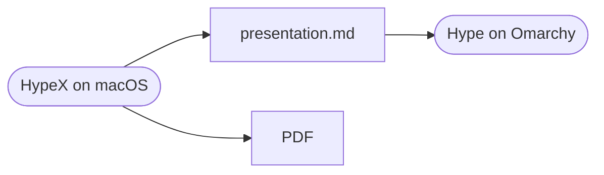

# Draft on the Mac

Present on Omarchy.

---

# One Markdown file

- Write slides in Markdown
- Draft them on macOS with HypeX
- Present them with Hype on Omarchy
- Same file, same slides

---

# The same pipeline



---

# Code, highlighted

```ruby
class Deck
  def present(on:)
    slides.each { |slide| on.show(slide) }
  end
end
```

---

> Say less per slide.
> Give each idea room to breathe.

— Hype

---

| Key | macOS |
| --- | --- |
| Present | ⌥⌘P or F5 |
| Headline | ⌘1 |
| Overview | ⌘0 |
| Delete slide | ⌫ |
