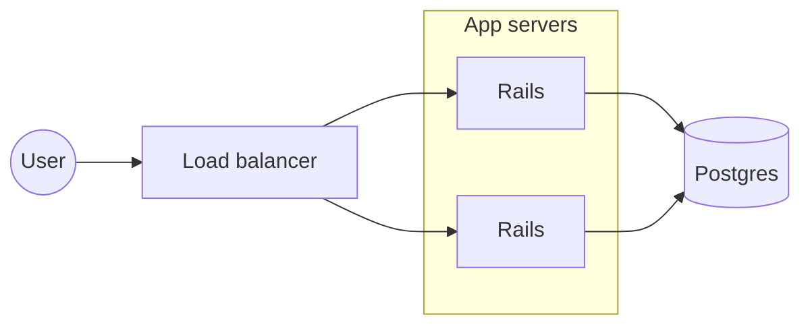

# Writing a Hype presentation

A presentation is one Markdown file. Edit it with any text tool, then use
`hype check`, `hype render`, and `hype export` to verify and ship it. If the
file is open in the Hype editor, saved edits appear there as long as the editor
has no unsaved changes of its own.

## Layout on disk

```text
my-talk/
  presentation.md
  images/      photos, diagrams, animated GIF/WebP, SVG
  videos/      mp4, m4v, mov, webm, mkv
```

Media is referenced by filename only: `` reads `images/city.jpg`
and `` reads `videos/demo.mp4`.

## Front matter

```markdown
---
title: "My talk"
theme: tokyo-night
font: "JetBrains Mono"
---
```

`hype new` writes this for you, along with the theme's `color_*` values.
`hype themes` lists the installed themes. Any `color_*` value can be
overridden with a `#rrggbb` color: `color_background`, `color_foreground`,
`color_accent`, `color_green`, `color_red`, `color_yellow`, `color_magenta`,
`color_cyan`, `color_dark_foreground`.

## Slides

Separate slides with a line holding only `---`, with a blank line on either
side. Slides are 16:9 and text is sized to fit, so say less per slide: a
headline, a few bullets, or one short quote. `hype check` warns when a slide
holds so much that its text shrinks below a readable size.

````markdown
# A big idea

---

# Keep it simple

- Write in Markdown
- Tell your story

---

> Make something wonderful.

---

```ruby
puts "Code is highlighted when you name the language"
```
````

- `# Headline` is big. Lists, quotes, tables, and inline `code` work.
- `*asterisks*` are italic, `**double**` is bold, `_underscores_` underline.
- Ordinary line breaks stay visible on the slide.
- `<!-- comments -->` are hidden from the slide; use them for speaker notes
  (see Speaker notes below).
- `<!-- hype: duration="20m" -->` on the first slide sets the talk's length;
  Presenter View counts it down from the second slide. Also `1h 30m`, `25:00`.
- A `---` inside a code fence does not split the slide.

## Images and video

Each slide takes one image or video. Options go inside the brackets:

| Markdown | Result |
| --- | --- |
| `` | Show the whole image |
| `` | Fill the slide, cropping as needed |
| `` | Show the whole image, with any text overlaid |
| `` | Fill the space around it with a color |
| `` | Fill it with a blurred copy of the image |
| `` | Match the image's edge color |
| `` | Darken the picture behind text, from 0 to 1 |
| `` | Loop a video without sound |
| `` | Wait for Space to play the video |
| `` | Show an image from `images/` until it plays |

Text on an image slide is overlaid in white over a slightly darkened picture.
An image with a headline spans the slide unless you say `fit`.

## Speaker notes

Every `<!-- comment -->` on a slide is a speaker note, except comments inside
code blocks and comments that begin with `hype`, which are layout directives.
Several comments on one slide are joined in order. Presenter View shows them as
written. A PowerPoint export puts them on each slide's notes page and formats
them:

- `**bold**`, `*italic*`, `_underline_`, `~~struck~~`, `` `code` ``
- `<b>`, `<i>`, `<u>`, `<s>`, `<code>`, and `<br>` for a line break
- `[text](https://…)` links; only `https`, `http`, and `mailto` are clickable
- `- item` and `1. item` lists, indented two spaces per level; `# Heading`

Each line of a note stays its own line. Anything else is kept as written.

```markdown
# Why now

<!-- **Pause** here. Ask who shipped a talk this year.
- mention the _Rails World_ demo
- link: [slides](https://example.com/talk) -->
```

## Diagrams

A `mermaid` code block draws a Mermaid flowchart in the theme's colors and
font. It counts as the slide's image, so a slide takes one image, video, or
diagram, and a headline above it sits in a band at the top.

````markdown
# How a request flows


````

- Directions: `flowchart TD`, `LR`, `BT`, `RL`; a subgraph can set its own
  `direction`, unless a link from outside reaches a node inside it. Then, as in
  Mermaid, it follows the diagram's direction so the link can route around.
- Shapes: `[box]`, `(rounded)`, `([stadium])`, `[[subroutine]]`,
  `[(database)]`, `((circle))`, `(((double circle)))`, `{decision}`,
  `{{hexagon}}`, `[/lean/]`, `[\lean\]`, `[/trapezoid\]`, `[\trapezoid/]`,
  `>flag]`, and `A@{ shape: cyl, label: "Text" }`.
- Links: `-->`, `---`, `-.->`, `==>`, `~~~` (invisible), `<-->`, `--o`,
  `--x`; labels as `-->|text|` or `-- text -->`; more dashes make a link longer.
- Colors: `classDef`, `class`, `:::name`, and `style` set fill, stroke, and color.
- Only flowcharts are drawn; `hype check` reports any other diagram type and
  every syntax error with its line within the diagram.

## Commands

```text
hype new talk/presentation.md --title "My talk" --theme tokyo-night
hype check talk/presentation.md --json     every problem, with slide and line
hype slides talk/presentation.md --json    an outline of the slides
hype render talk/presentation.md --slide 3 -o slide.png
hype render talk/presentation.md -o slides/        every slide, plus slides.json
hype export talk/presentation.md talk.pdf          or talk.pptx
```

A `.pptx` holds each slide as a 4K picture, so its text is not editable in
PowerPoint; edit the Markdown and export again. Videos keep their options and
are converted to H.264 MP4 when needed; a `span` video must be 16:9. Animated
GIFs and WebPs become looping movies, and speaker notes become notes pages.

Commands need no display. They exit 0 on success and 1 on failure, with errors
on stderr. Render a slide and look at the PNG to judge how it reads.
