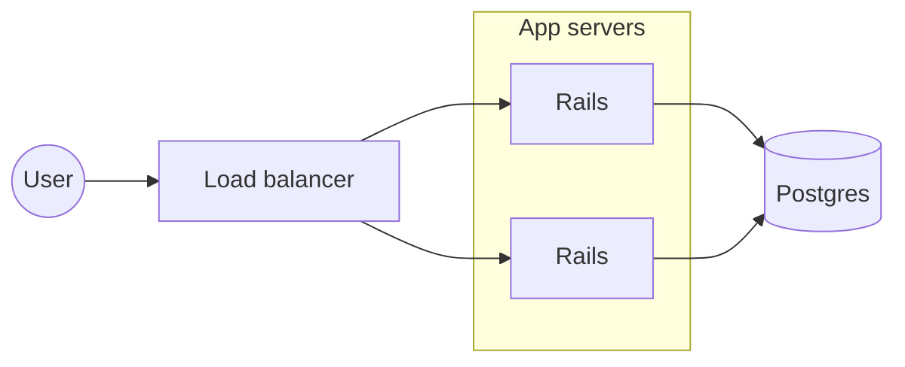

# Writing a Hype presentation

A presentation is one Markdown file. Edit it with any text tool, then use
`hype check`, `hype render`, and `hype export` to verify and ship it. If the
file is open in the Hype editor, saved edits appear there as long as the editor
has no unsaved changes of its own.

## Layout on disk

```text
my-talk/
  presentation.md
  images/      photos, diagrams, animated GIF/WebP, SVG
  videos/      mp4, m4v, mov, webm, mkv
```

Media is referenced by filename only: `` reads `images/city.jpg`
and `` reads `videos/demo.mp4`.

## Front matter

```markdown
---
title: "My talk"
theme: tokyo-night
font: "JetBrains Mono"
---
```

`hype new` writes this for you, along with the theme's `color_*` values.
`hype themes` lists the installed themes. Any `color_*` value can be
overridden with a `#rrggbb` color: `color_background`, `color_foreground`,
`color_accent`, `color_green`, `color_red`, `color_yellow`, `color_magenta`,
`color_cyan`, `color_dark_foreground`.

`**Bold**` text uses the accent color and the font's bold weight. To give it
a font and color of its own, add `bold_font: "Arial Black"` and
`bold_color: "#d0021b"`; either can be left out. Choosing a theme keeps
them. Hype on Omarchy ignores them and shows its usual bold.

Text is centered on the slide, with lists, quotes, code and tables starting
on the left. `alignment: left` (or `center`, `right`) and
`vertical_alignment: top` (or `center`, `bottom`) in the front matter move
it on every slide, lists included; a slide's own setting (see Slide settings)
overrides them. Hype on Omarchy ignores both keys.

For a deck that looks the same everywhere, use a font Omarchy installs by
default: JetBrains Mono, Noto, or iA Writer. `hype check` warns about any
other `font` or `bold_font`.

## Slides

Separate slides with a line holding only `---`, with a blank line on either
side. Slides are 16:9 and text is sized to fit, so say less per slide: a
headline, a few bullets, or one short quote. `hype check` warns when a slide
holds so much that its text shrinks below a readable size.

````markdown
# A big idea

---

# Keep it simple

- Write in Markdown
- Tell your story

---

> Make something wonderful.

---

```ruby
puts "Code is highlighted when you name the language"
```
````

- `# Headline` is big. Lists, quotes, tables, and inline `code` work.
- `*asterisks*` are italic, `**double**` is bold, `_underscores_` underline.
- Ordinary line breaks stay visible on the slide.
- `<!-- comments -->` are hidden from the slide; use them for speaker notes
  (see Speaker notes below).
- A `---` inside a code fence does not split the slide.

## Slide settings

A comment that begins with `hype:` sets values for its slide instead of being
a note. Put several in one comment: `<!-- hype: background="#000000" foreground="#ffffff" -->`.

| Setting | Effect |
| --- | --- |
| `background="#rrggbb"` | This slide's background color |
| `foreground="#rrggbb"` | This slide's text color |
| `alignment="left"` | Align the text to the left; also `"center"`, `"right"`, or `"auto"` for the usual rule |
| `vertical_alignment="top"` | Move the text to the top; also `"center"`, `"bottom"`, or `"auto"` (centered) |
| `layout="image-right"` | Separate text and image; also `"image-left"`, `"image-bottom"`, or `"overlay"` (the default) |
| `layout="image-full"` | Use the whole canvas for an image, including `fit` with no inset margins; any text is overlaid |
| `image_blur="false"` | Keep the image sharp behind text; `"true"` softens it; `"text"` keeps it sharp and blurs only a panel under the text. Defaults to true for the ordinary overlay layout, false for explicit image layouts |
| `panel_blur="40"` | With `image_blur="text"`: the panel's blur radius; also `panel_color`, `panel_opacity`, `panel_radius` (below) |
| `duration="20m"` | On the first slide only: the talk's length, counted down in Presenter View from the second slide. Also `45 min`, `1h 30m`, `90s`, `25:00` |

`alignment` and `vertical_alignment` override the front matter for their slide.
The whole text moves as one block, over the picture on an image slide. Above
a video or diagram the headline keeps its band at the top and ignores
`vertical_alignment`. Hype on Omarchy reads `alignment="left"` and `"center"`
and ignores the other values and `vertical_alignment`.

`hype check` warns about a length it can't read, or one on a later slide; about
an alignment it can't read; and about a video or diagram slide that sets its own
`vertical_alignment` to `top` or `bottom`.

`layout="image-full"` with `` shows the whole image as large
as the canvas allows, without the normal inset margins. It keeps the image sharp;
text, if any, is overlaid with the usual default darkening. Use `span` for a crop.

Separate image layouts reserve 45% of the slide for text and 55% for the image
on the named side. `image-bottom` reserves a 280px headline band above the image
on a 1920×1080 slide. Text alignment applies within its reserved space; images
use `fit` (whole picture) or `span` (fill their region, cropping as needed).
Separate layouts keep the theme's text color, with no default darkening or blur.
An explicit `overlay` or media `background` affects only the image region.
They require an image, not a video or Mermaid diagram. Without an image the
text uses the ordinary full-slide layout. `image_blur` controls the image itself,
not a `background=blur` backdrop. Hype on Omarchy ignores these comments and
uses its ordinary overlaid image layout; the Markdown remains readable.

```markdown
<!-- hype: layout="image-right" alignment="left" -->
# Just one more prompt


```

`image_blur="text"` puts the text on a rounded panel, 48px wider and 32px
taller than the text on each side, filled with a heavily blurred copy of the
picture and a tint. The rest of the picture stays sharp and undarkened (the
media `overlay` option still darkens all of it), and the panel follows
`alignment` and `vertical_alignment`. Tune the panel with slide settings in the
same comment, all in 1080p slide pixels:

| Setting | Default | Meaning |
|---------|---------|---------|
| `panel_blur="40"` | `40` | Blur radius, 0 to 200; `0` tints without blurring |
| `panel_color="#000000"` | `#000000` | Tint color |
| `panel_opacity="0.35"` | `0.35` | Tint strength, 0 to 1 |
| `panel_radius="28"` | `28` | Corner radius, 0 to 200 |

Text is white, or dark on a light `panel_color` at `panel_opacity` 0.5 or more;
`foreground` overrides it. `panel_*` settings without `image_blur="text"`, or
out of range, are `hype check` errors. It works with the ordinary overlay and
`image-full`; with a video or a separate layout `hype check` reports an error. Hype on Omarchy ignores it and shows its usual
overlaid image.

```markdown
<!-- hype: image_blur="text" panel_blur="60" panel_color="#1a1b26" panel_opacity="0.5" -->


# Night shift
```

## Images and video

Each slide takes one image or video. Options go inside the brackets:

| Markdown | Result |
| --- | --- |
| `` | Show the whole image |
| `` | Fill the slide, cropping as needed |
| `` | Show the whole image, with any text overlaid |
| `` | Fill the space around it with a color |
| `` | Fill it with a blurred copy of the image |
| `` | Match the image's edge color |
| `` | Darken the picture behind text, from 0 to 1 |
| `` | Loop a video without sound |
| `` | Wait for Space to play the video |
| `` | Show an image from `images/` until it plays |

Text on an image slide is overlaid in white over a slightly darkened picture.
An image with a headline spans the slide unless you say `fit`.

## Speaker notes

Every `<!-- comment -->` on a slide is a speaker note, except comments inside
code blocks and comments that begin with `hype`, which are layout directives.
Several comments on one slide are joined in order. Presenter View shows them as
written. A PowerPoint or Keynote export puts them on each slide's notes page and
formats them:

- `**bold**`, `*italic*`, `_underline_`, `~~struck~~`, `` `code` ``
- `<b>`, `<i>`, `<u>`, `<s>`, `<code>`, and `<br>` for a line break
- `[text](https://…)` links; only `https`, `http`, and `mailto` are clickable
- `- item` and `1. item` lists, indented two spaces per level; `# Heading`

Each line of a note stays its own line. Anything else is kept as written.

```markdown
# Why now

<!-- **Pause** here. Ask who shipped a talk this year.
- mention the _Rails World_ demo
- link: [slides](https://example.com/talk) -->
```

## Diagrams

A `mermaid` code block draws a Mermaid flowchart in the theme's colors and
font. It counts as the slide's image, so a slide takes one image, video, or
diagram, and a headline above it sits in a band at the top.

````markdown
# How a request flows


```mermaid
flowchart LR
  user((User)) --> lb[Load balancer]
  subgraph app [App servers]
    web1[Rails] & web2[Rails]
  end
  lb --> web1 & web2
  web1 & web2 --> db[(Postgres)]
```
````

- Directions: `flowchart TD`, `LR`, `BT`, `RL`; a subgraph can set its own
  `direction`, unless a link from outside reaches a node inside it. Then, as in
  Mermaid, it follows the diagram's direction so the link can route around.
- Shapes: `[box]`, `(rounded)`, `([stadium])`, `[[subroutine]]`,
  `[(database)]`, `((circle))`, `(((double circle)))`, `{decision}`,
  `{{hexagon}}`, `[/lean/]`, `[\lean\]`, `[/trapezoid\]`, `[\trapezoid/]`,
  `>flag]`, and `A@{ shape: cyl, label: "Text" }`.
- Links: `-->`, `---`, `-.->`, `==>`, `~~~` (invisible), `<-->`, `--o`,
  `--x`; labels as `-->|text|` or `-- text -->`; more dashes make a link longer.
- Colors: `classDef`, `class`, `:::name`, and `style` set fill, stroke, and color.
- Only flowcharts are drawn; `hype check` reports any other diagram type and
  every syntax error with its line within the diagram.

## Commands

```text
hype new talk/presentation.md --title "My talk" --theme tokyo-night
hype themes                                the installed themes
hype check talk/presentation.md --json     every problem, with slide and line
hype slides talk/presentation.md --json    an outline of the slides
hype render talk/presentation.md --slide 3 -o slide.png
hype render talk/presentation.md -o slides/        every slide, plus slides.json
hype export talk/presentation.md talk.pdf          or talk.pptx, or talk.key
```

A `.pptx` holds each slide as a 4K picture, so its text is not editable in
PowerPoint; edit the Markdown and export again. Videos keep their options and
are converted to H.264 MP4 when needed; a `span` video must be 16:9. Animated
GIFs and WebPs become looping movies, and speaker notes become notes pages.

A `.key` is that PowerPoint export converted by Keynote, with the same pictures,
videos and notes. It works only in HypeX on macOS with Keynote installed, and
fails with a message if Keynote is missing or HypeX (or the terminal running
`hype`) may not control it. Hype on Omarchy exports only `.pdf` and `.pptx`.

Commands need no display. They exit 0 on success and 1 on failure, with errors
on stderr. Render a slide and look at the PNG to judge how it reads.
`hype open talk/presentation.md` opens the editor, which needs the desktop.
